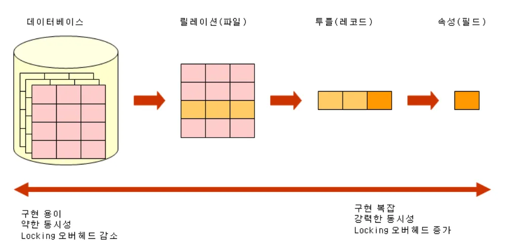
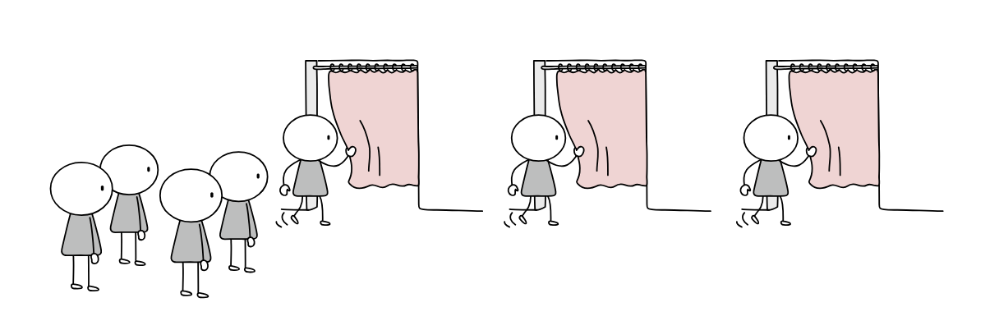

## 동시성제어(concurrency control)

다중 사용자 환경을 지원하는 데이터베이스시스템에서 여러 트랜잭션들이 성공적으로 동시에 실행될 수 있도록 지원하는 기술을 의미합니다. 트랜잭션간의 간섭으로 문제가 발생하지 않도록 트랜잭션의 실행순서를 제어하는 기법입니다. 동시성제어는 실생활에 사용되고 있는 소프트웨어 서비스에서도 많이 활용되고 있습니다.

- 금융서비스에서 금액 송금/저금
- 쇼핑몰서비스에서 주문처리/재고감소/결제요청
- 동시 접속자수가 많은 실시간 앱에서 채팅/댓글/좋아요 수 증가
- 포인트나, 캐시백을 적립/사용
- 이벤트 응모와 선착순쿠폰 발급

### 동시성제어를 하지 않으면 어떤 문제가 발생할까?

| 문제점                            | 설명                                                                                                                    |
| --------------------------------- | ----------------------------------------------------------------------------------------------------------------------- |
| **갱신내용 손실(lost update)**    | 트랜잭션들이 동일한 데이터를 동시에 갱신하는 경우에 발생합니다.                                                         |
|                                   | 이전 트랜잭션이 데이터를 갱신한 후에 트랜잭션을 종료하기전에 나중 트랜잭션이 갱신값을 덮어쓰는 경우에 발생합니다.       |
| **현황파악 오류(dirty read)**     | 트랜잭션의 중간 수행결과를 다른 트랜잭션이 참조함으로써 오류가 발생합니다.                                              |
| **모순성(inconsistency)**         | 두 트랜잭션이 동시에 실행할 때 데이터베이스가 일관성이 없는 상태로 남는 문제가 발생합니다.                              |
| **연쇄복귀 (cascading rollback)** | 복수의 트랜잭션이 데이터 공유시 특정 트랜잭션이 처리를 취소할때 다른 트랜잭션이 처리한 부분에 대한 취소가 불가능합니다. |

### 동시성제어에는 어떤 제어기법이 있을까?

#### 잠금(locking)


잠금(locking)은 하나의 트랜잭션이 실행하는 동안 특정 데이터 항목에 대해서 다른 트랜잭션이 동시에 접근하지 못하도록한 상호배제(mutual exclusive) 입니다. 하나의 트랜잭션이 데이터 항목에 대해서 잠금(lock)을 설정하면 잠금을 설정한 트랜잭션이 잠금해제(unlock)할 때까지 데이터를 독점적으로 사용할 수 있습니다.

- 잠금(lock)의 종류
  | 종류 | 주요 개념 |
  |---- | ---- |
  | 공유락(shared lock: S-lock)| 공유잠금한 트랜잭션은 데이터 항목에 대해서 읽기(read)만 가능합니다. |
  | | 다른 트랜잭션도 읽기(read)만을 실행할 수 있는 형태 입니다.|
  | 배타락(exclusive lock: X-lock)|전체잠금한 트랜잭션은 데이터 항목에 대해서 읽기(read)와 쓰기(write) 모두 가능합니다.|
  || 다른 트랜잭션은 읽기(read)와 쓰기(write)를 모두 할 수 없습니다.|

- 비관적락(pessimistic lock)과 낙관적락(optimistic lock)

- 잠금의 단위



잠금의 단위는 **잠금의 대상이 되는 데이터 객체의 크기** 를 의미합니다.
작게는 레코드의 필드값, 하나의 레코드, 물리적 입출력 단위가 되는 디스크블록이 될 수 있으며, 크게는 테이블이나 데이터베이스까지 하나의 잠금의 단위가 될 수 있습니다.

잠금의 단위가 클수록 동시성(병행성) 수준은 낮아지고, 동시성 제어기법은 간단해집니다.
반면에 잠금의 단위가 작을수록 동시성(병행성) 수준은 높아지고, 동시성 제어기법 관리는 복잡해집니다.

상호배제인 잠금은 교착상태(deadlock)가 발생할 수 있습니다.

#### 타임스탬프 순서 기법

트랜잭션을 식별하기 위해 DBMS 가 부여하는 유일한 식별자인 타임스탬프를 지정하여 트랜잭션간의 순서를 미리선택하는 기법입니다. 데이터베이스 시스템에 들어오는 트랜잭션 순서대로 타임스탬프를 지정하여 동시성 제어의 기준으로 사용됩니다.

---

## 프로세스 동기화

동시성제어에는 운영체제 프로세스의 상호배제 동기화 개념들과 많이 연결되어 있습니다.
그래서 관련용어에 대해 전공서적을 읽어보고 정리해봤습니다.

### 동기화(synchronization)

- **프로세스들 사이의 수행시기를 맞추는 것** 을 의미하며, 프로세스 동기화 라고도 정의합니다. 프로세스들 사이의 수행시기를 맞춘다 함은 특정 자원에 접근할때 하나의 프로세스만 접근하거나 프로세스를 올바른 순서대로 실행하는 것을 두가지를 일컫습니다.

- **실행순서제어** 를 위한 동기화: 동시에 실행되는 프로세스를 올바른 순서대로 실행하는 것을 의미합니다.

- **상호배제** 를 위한 동기화: 상호배제는 공유가 불가능한 자원, 동시에 접근이 안되는 자원을 동시에 접근하지 못하게 하는 것을 의미합니다.

### 공유자원 과 임계구역 과 레이스컨디션

#### **공유자원(shared resource)**

공유자원은 **여러 프로세스가 공동으로 사용하는 자원** 을 의미합니다. 전역변수가 될 수도 있고, 파일이 될 수도, 입출력장치, 보조기억장치가 될수도 있습니다.

#### **임계구역(critical section)**

두개 이상의 프로세스가 동시에 실행되면 문제가 발생하는 코드영역 을 의미합니다.

만일 두개 이상의 프로세스가 임계 구역에 진입하고자 하면 둘 중 하나는 대기를 해야합니다. 임계구역에 먼저 진입한 프로세스의 작업이 마무리되면 그제서야 기다렸던 프로세스가 임계구역에 진입합니다.

#### **레이스컨디션(race condition)**

여러 프로세스가 동시다발적으로 임계 구역의 코드를 실행하여 데이터의 일관성이 깨지는 문제가 발생하는 것을 의미합니다.

상호배제를 위한 동기화는 두개이상의 프로세스가 임계구역에서 동시에 접근하지 못하도록 관리하는 것을 의미합니다.
운영체제는 이러한 임계구역 문제를 아래 세가지 원칙하에 해결하며 상호배제를 위한 동기화를 위해서는 3가지 원칙이 반드시 지켜져야합니다.

- (원칙1) **상호배제**: 한 프로세스가 임계구역에 진입했다면 다른 프로세스는 임계구역에 들어갈 수 없습니다.
- (원칙2) **진행**: 임계구역에 어떤 프로세스도 진입하지 않았다면 임계구역에 진입하고자하는 프로세스는 들어갈 수 있어야합니다.
- (원칙3) **유한대기**: 한 프로세스가 임계구역에 진입하고 싶다면 그 프로세스는 무한대기를 하지않고 언젠가는 임계구역에 들어올 수 있어야합니다.

### 뮤텍스락 (mutex)

임계구역을 잠금으로써 프로세스간 상호배제를 이루는 동기화 도구 입니다.


> 일상생활에서 탈의실/화장실이 대표적인 예입니다.
> 앞에 줄이 없고 비어있다면 사용자는 빈 장소에 들어가서 탈의실/화장실 을 이용할 수 있습니다.
>
> 반대로 앞에 줄이 서있거나 탈의실/화장실이 자물쇠(잠금장치)로 잠겨있다면 앞의 사람이 먼저 이용중임을 판단하고 앞사람이 다할때까지 기다려야합니다.
>
> 앞의 사람이 잠금을 해제하고 열쇠를 반납했다면, 이용이 가능하므로 열쇠를 가져가서 '잠금'상태로하여 이용을 합니다. 이용을 다하면 잠금을 해제하고 열쇠를 반납하여 나옵니다.
>
> - 사람/이용자는 프로세스를 의미합니다.
> - 화장실/탈의실은 임계구역을 의미합니다.
> - 열쇠는 뮤텍스 입니다.

자물쇠(잠금장치)를 담당하는 뮤텍스는 상호배제를 위한 동기화 도구입니다.
락을 획득할 수 없다면 프로세스는 임계구역에 진입하지 못한채 무작정 기다리고 있어야하며, 락을 획득할 수 있다면 임계구역에 집입하여 잠근뒤에 임계구역에서 작업을 진행한뒤에 임계구역에 빠져나와서 임계구역의 잠금을 해제합니다.

### 세마포어 (semaphore)



세마포어는 공유자원이 여러개 있는 임계 구역 문제도 해결할 수 있는 동기화 도구 입니다.

뮤텍스는 하나의 공유자원에 접근하는 프로세스를 상정한 방식입니다. 화장실/탈의실 1개만 있을 경우를 가정해서 만든 동기화 도구입니다.

화장실/탈의실 이 여러개 있을 경우에 여러개의 프로세스가 각각 공유자원에 접근이 가능해야 합니다. 만일 화장실/탈의실이 3개가 있지만 탈의실 1개당 한사람이 이용할 수 있지만 3명이 동시에 화장실/탈의실을 이용할 수 있습니다.

---

## 교착상태(deadlock)

프로세스를 실행하기 위해서 자원이 필요한데 두 개이상의 프로세스가 각자 가지고 있는 자원을 무작정 기다리게되면 교착상태가 됩니다.

식사하는 철학자문제 는 교착상태를 설명하는데 사용되는 문제상황입니다.

> 동그란 원탁에 다섯명의 철학자가 앉아있습니다.
> 철학자들 앞에서는 맛있는 식사가 있고 철학자들 사이 사이에는 식사에 필요한 포크가 있습니다.
> 철학자들 앞에 있는 식사는 두개의 포크로 먹을 수 있는 음식이라 가정합니다.
> 모든 철학자가 동시에 포크를 집어서 식사를 하게된다면 어떤 철학자도 식사를 할 수 없고 영원히 생각만 해야하는 상황이 발생할 수 있습니다. 다른 철학자가 포크를 내려놓을 때까지 기다리는겁니다.

**일어나지 않을 사건을 무한히 기다리며 진행이 멈춰버리는 현상**을 데드락이라고 합니다.

### 교착상태 발생조건

교착상태가 발생할 조건에는 '상호배제', '점유와 대기', '비선점', '원형대기' 로 4가지가 존재합니다.
아래 조건중 하나라도 만족하지 않다면 교착상태가 발생하지 않지만, 아래 조건중 하나를 만족하게 되면 교착상태가 발생할 가능성이 있습니다.

- **상호배제(mutual exclusion)** : 프로세스가 사용하는 자원을 다른 프로세스가 사용할 수 없음을 의미하며, 자원을 사용하려면 1개의 프로세스만이 사용가능하며 다른 프로세스들은 작업이 완수할 때까지 기다려야합니다.
- **점유와 대기(hold and wait)** : 어떠한 자원을 할당 받은 상태에서 다른 자원을 할당 받기를 기다릴 경우를 의미합니다.
- **비선점(nonpreemetive)** : 비선점 자원은 그 자원을 이용하는 프로세스의 작업이 끝나야만 비로소 이용을 할 수 있습니다. 즉, 어떤 프로세스도 다른 프로세스의 자원을 강제로 뺏지 못하는 것을 의미합니다.
- **원형대기(circular wait)** : 프로세스들이 원의 형태로 자원을 대기하는 것을 의미합니다.

### 교착상태 해결방법

- **교착상태 예방** : 프로세스들에 자원을 할당할 때, 상호배제/점유와 대기/비선점/원형대기 중 하나의 조건이라도 만족시키지않게 할당하는 방법입니다.
- **교착상태 회피** : 교착상태가 발생하지 않을 정도로만 프로세스들에게 배분할 수 있는 자원의 양을 고려하여 자원을 할당받는 방식입니다.
    - **안전 상태** : 교착상태가 발생하지 않고 모든 프로세스가 정상적으로 자원을 할당받고 종료될 수 있는 상태
    - **불안전 상태** : 교착상태가 발생할 수 있는 상황
    - **안전 순서열** : 교착상태없이 안전하게 프로세스들에 자원을 할당할 수 있는 순서를 의미합니다.
- **교착상태 검출후 회복** : 교착상태 발생을 인정하고 사후에 조치하는 방식입니다.
    - **선점을 통한 회복** : 교착 상태가 해결될 때까지 다른 프로세스로부터 자원을 강제로 뺏고, 한개의 프로세스씩 자원을 몰아주는 방식입니다. 하지만 자원을 뺏겨버려서 프로세스들의 작업내역을 잃을 가능성이 있습니다.
    - **프로세스 강제 종료를 통합 회복** : 프로세스를 모두 강제종료하거나 교착상태가 없어질 때까지 한개의 프로세스씩 강제로 종료하는 방법입니다. 하지만 교착 상태가 없어졌는지 확인하는 과정에서 오버헤드를 야기할 수 있습니다.

---

## Java 언어에서의 동시성제어 방식은 어떤게 있을까?

| 범주                        | 방법                                   | 설명                                                                                                             |
| --------------------------- | -------------------------------------- | ---------------------------------------------------------------------------------------------------------------- | --- |
| JVM 레벨                    | `synchronized`, `ReentrantLock`        | 한 JVM 내에서만 유효한 락이며, 멀티 인스턴스 환경에서는 무의미하다.                                              |     |
|                             | JVM 내 큐기반 처리 `ConcurrentHashMap` | 동시성 제어를 위한 직렬화 전략으로 여러요청이 한번에 와도 각 요청을 큐에 넣고 하나씩 처리한다.                   |
| DB 레벨                     | 비관적락(Pessimistic Lock)             | 조회시 락을 걸고 다른 트랜잭션을 차단하여 데이터충돌을 미연에 방지한다. 데드락이 발생하여 성능저하가 올 수 있다. |
|                             |                                        | `@Lock(LockModeType.PESSIMISTIC_WRITE)`                                                                          |
|                             | 낙관적락(Optimistic Lock)              | 충돌가능성을 감안하고 수정하며, 충돌이 발생하면 롤백한다                                                         |
| 분산환경                    | Redisson, Redis Lock, Zookeeper 등     | 분산락 구현 가능. 멀티인스턴스 환경에서 락공유가 가능하다.                                                       |
| 비동기식 직렬화 큐기반 처리 | Kafka, RabbitMQ 등으로 직렬화 처리     | 비동기식 직렬화 방식                                                                                             |

- 직렬화(serialization): 객체의 상태를 바이트스트림으로 변환하여 파일이나 네트워크를 통해 전송할 수 있게하는 과정이며, 분산시스템에서도 객체의 상태를 전송하고 수신자측에서는 이를 다시 객체로 복원하여(역직렬화)하여 사용할 수 있습니다.

---

## 어떻게 서비스에서 동시성제어를 적용해야할까?

> 미션 상황: 동일한 사용자가 동시에 포인트를 충전할 경우 해당요청이 정상적으로 처리되어야합니다.

JVM 내에서 동시성테스트를 하려고한다면, synchornized, ReentrantLock, JVM 내 큐(queue)를 사용하는 방법이 존재합니다. 그러나 동시성제어를 테스트할때 통합테스트에서 실행해야되는건지 아니면 유닛테스트에서 테스트를 해야될지 애매할겁니다.

단위테스트는 가장 작은 테스트인만큼 1개 메서드/함수 단위로 독립적인 기능을 빠르게 검증하기 위한 테스트입니다.
동시요청이 발생할 때 큐를 이용해서 순서를 제공해주거나 잠금(locking)연산을 수행하여 다른요청이 접근하지 못하도록 막거나, 큐를 이용해서 순서를 보장해줘야하는 역할까지 검증을 해야되기 때문에 단위테스트만으로는 어려울거같습니다.

즉, 동시성은 여러개의 스레드가 동시에 접근하거나 실행될 때 발생하는 문제를 검증해야하므로, 단일 스레드 환경에서 실행되는 단위테스트만으로는 동시적인 상황을 재현하기가 어렵습니다. **따라서 동시성을 테스트하려면 통합테스트로 검증** 해야됩니다.

### synchronized 활용하기

- `synchronized`는 하나의 스레드만 임계영역(critical section)에 접근하도록 보장하는 키워드로, 공유자원에 대한 동시접근을 차단하여 Race Condition을 방지합니다.

> 유저포인트 ID(id) 마다 락을 관리 - ConcurrentHashMap 으로 분리된 락들을 관리

```java
@Component
public class UserPointLockManager {
	// 사용자별 분리된 락을 관리하는 맵
	// 1. 사용자 ID(id) 마다 하나의 고유한 락(Object)를 저장하는 맵
	// 2. synchronized에 넘길 락을 하나만 쓰면 전역락(exclusive lock)이 되므로 사용자별로 분리된 락객체를 관리
	private final ConcurrentHashMap<Long, Object> locks = new ConcurrentHashMap<>();

	// getLock: 사용자 ID(id)에 해당하는 락(lock)을 획득.
	public Object getLock(Long id) {
		// locks.computeIfAbsent(id, key -> new Object());
		// 1. 사용자 ID(id)에 해당하는 락객체가 이미 있으면 그 객체를 반환하고, 없다면 새로운 락을 넣는다.
		// 2. 사용자 ID(id)별 하나의 고유한 락을 필요할 때만 만들고 중복으로 만들지않도록 보장한다.
		return locks.computeIfAbsent(id, key -> new Object());
	}
}
```

> 충전 서비스 내부로직에 synchronized 블록을 추가하여 임계구역 블록 지정하기

```java
@RequiredArgsConstructor
public class PointServiceImpl implements PointService {

	private final UserPointRepository userPointRepository;
	private final PointHistoryRepository pointHistoryRepository;
	private final UserPointLockManager userPointLockManager;
	private static final Logger log = LoggerFactory.getLogger(PointServiceImpl.class);

  ...

@Override
	public ChargeResponse charge(ChargeRequest request) {
		long id = request.id();
		long amount = request.amount();

		// synchronized 예약어를 붙인 블록은 임계영역으로 : 유저포인트 ID(id)의 lock을 사용하여 다른요청의 접근을 제한한다.
		synchronized (userPointLockManager.getLock(id)){
			// 로그기록
			log.info("::: 🔒 Lock acquired for userId: {}, thread: {}", id, Thread.currentThread().getName());

			UserPoint userPoint = this.userPointRepository.findById(id);
			long myPoint = userPoint.point();

			// 포인트내역에 '충전' 기록
			this.pointHistoryRepository.insert(id, amount, TransactionType.CHARGE);

			// 포인트 충전
			UserPoint result = this.userPointRepository.save(id, myPoint + amount);
			return ChargeResponse.from(result);
		}
	}
}
```

### ReentrantLock 활용하기

`ReentrantLock`은 동일한 쓰레드가 여러번 락을 획득할 수 있는 재진입이 가능한 락으로 `synchronized` 보다 더 정밀한 락제어와 락 확인 상태, 타임아웃, 인터럽트 처리등이 가능한 클래스입니다. 또한 `ReentrantLock`은 실시간 제어, deadlock 회피, 락 상태 진단 등 고급제어가 필요할 때 적합합니다.

> 유저포인트 ID(id) 마다 락을 관리 - ConcurrentHashMap 으로 분리된 락들을 관리

```java
@Component
public class UserPointLockManager {
	private final ConcurrentHashMap<Long, ReentrantLock> locks = new ConcurrentHashMap<>();

	public ReentrantLock getLock(long id) {
		return locks.computeIfAbsent(id, key -> new ReentrantLock());
	}
}
```

> 충전 서비스 내부로직에 try블록을 임계구역 블록 지정하고
> 임계구역 입구에는 `lock.lock()`은 잠금상태인지(이미 요청작업을 수행하고있는 중인지) 아닌지를 확인하고, 잠겨있다면 끝날때까지 기다려야한다. 반대로 열려있는 상태라면 임계영역에 진입하여 잠근다.
> 작업결과에 상관없이 요청작업 수행이 완료되면 `lock.unlock()`으로 잠금을 해제한다

```java
@Service
@RequiredArgsConstructor
public class PointServiceImpl implements PointService {

	private final UserPointRepository userPointRepository;
	private final PointHistoryRepository pointHistoryRepository;
	private static final Logger log = LoggerFactory.getLogger(PointServiceImpl.class);
	private final UserPointLockManager userPointLockManager;

	@Override
	public ChargeResponse charge(ChargeRequest request) {
		long id = request.id();
		long amount = request.amount();

		ReentrantLock lock = userPointLockManager.getLock(id);
		lock.lock(); // 락 획득하여 다른요청이 들어오지 못하도록 임계구역을 잠금
		try{
			// try 블록안은 임계구역 이므로, 하나의 요청이 작업을 수행
			log.info("::: 🔒 Lock acquired for userId: {}, thread: {}", id, Thread.currentThread().getName());
			UserPoint userPoint = this.userPointRepository.findById(id);
			long myPoint = userPoint.point();

			this.pointHistoryRepository.insert(id, amount, TransactionType.CHARGE); // 포인트내역에 '충전' 기록
			UserPoint result = this.userPointRepository.save(id, myPoint + amount); // 포인트 충전
			return ChargeResponse.from(result);
		} finally {
			lock.unlock(); // 락을 반환하여 임계구역을 잠금해제
		}
	}
}
```

### (공통) 동시성 테스트 코드

```java
@SpringBootTest
@AutoConfigureMockMvc
@TestInstance(TestInstance.Lifecycle.PER_CLASS) // 인스턴스를 공유
public class ChargeConcurrencyTest {
 @Autowired
 private MockMvc mockMvc;

 @Autowired
 private PointService pointService;

 @Autowired
 private UserPointRepository userPointRepository;

 @Autowired
 private PointHistoryRepository pointHistoryRepository;

 @Autowired
 private ObjectMapper objectMapper;

 @Autowired
 private UserPointLockManager userPointLockManager;


 @BeforeEach
 void setUp() {
  // UserPoint 의 초기 포인트값을 0 으로한다.
  userPointRepository.save(1L, 0L);
 }

@Test
 void 동시에_100번_충전요청을_요청했을때_정상적으로_합산에_성공해야한다() throws Exception {
  // given
  long id = 1L;
  int threadCount = 100;
  long chargeAmount = 1000L;

  ExecutorService executor = Executors.newFixedThreadPool(10); // 스레드풀 10개
  CountDownLatch latch = new CountDownLatch(threadCount); // 요청가능한 스레드개수
  ChargeRequestBody requestBody = new ChargeRequestBody(chargeAmount);
  String json = objectMapper.writeValueAsString(requestBody);

  // when
  for(int i = 0 ; i < threadCount ; i++) {
   executor.submit(()-> {
    try {
      // 충전 API 호출
     mockMvc.perform(patch("/point/"+id+"/charge")
      .contentType(MediaType.APPLICATION_JSON)
      .content(json));
    } catch (Exception e) {
     e.printStackTrace();
     throw new RuntimeException(e);
    } finally {
     latch.countDown(); // 요청가능 스레드 개수 감소
    }
   });
  }

  latch.await(); // 다 끝날 때까지 대기
  Thread.sleep(1000); // 1초 정도 대기후 최종 포인트 확인

  // then
  long expectedPoint = chargeAmount * threadCount;
  long finalPoint = userPointRepository.findById(id).point();
  assertEquals(expectedPoint, finalPoint);
 }
}
```

---

## 결론

- 현재 synchronized, ReentrantLock 등 JVM내에서만 활용되는 락이며 하나의 서버에서는 가능합니다.
- synchronized 은 임계구역을 블록으로 지정하여 나타내지만 단순하게 동시성제어를 처리하는데 좋습니다.
- ReentrantLock 은 임계구역을 진입하기전에는 lock를 임계구역을 빠져나오면 unlock 으로 명시하여 synchronized 보다는 정교하게 나타냅니다.
- 동시성제어와 관련된 테스팅은 작성할 때는 단위테스트보다 통합테스트가 적합합니다.
- 선입선출 자료구조인 큐(queue)를 이용해서 동시성제어 를 해결할 수 있습니다. 하지만 Lock다르게 여러 요청이 한번에 들어와도 각 요청을 큐에넣고 순차적으로 처리하는방식입니다. 오히려 동시성이슈를 제거시켜서 해결하는 방법도 있습니다.

### 보고서를 작성해보면서 느낀점

동시성 제어와 그와 관련된 운영체제 개념들을 정리를 이해하고나서 동시성제어에 대한 자료조사 아티클들을 읽어보니 조금씩 정리가 되는거 같았습니다. 왜 더 기본기를 중요하다고 하는게 몸으로 깨달았습니다. 앞으로도 이 Lock을 이용한 동시성제어를 깊게 다룰텐데, 여기서 더 확장된 데이터베이스에서의 락, Redis의 분산락, Kafka와 RabbitMQ와 같은 비동기식 큐를 이용한 직렬화에 대한 아티클들을 읽어보고싶습니다.

## 참고자료

- (도서) 혼자공부하는 컴퓨터구조+운영체제
- [동시성 제어 DB 운영](https://i-bada.blogspot.com/2012/04/db_24.html)
- [동시성 제어 개요](http://www.jidum.com/jidums/view.do?jidumId=282)
- [동시성 제어 기법 잠금 locking 기법](https://medium.com/pocs/%EB%8F%99%EC%8B%9C%EC%84%B1-%EC%A0%9C%EC%96%B4-%EA%B8%B0%EB%B2%95-%EC%9E%A0%EA%B8%88-locking-%EA%B8%B0%EB%B2%95-319bd0e6a68a)
